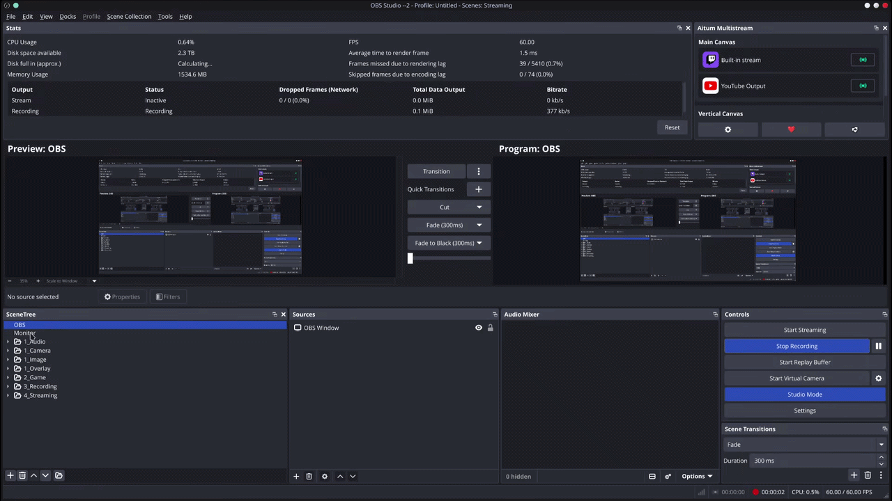

# Scene Tree View Plugin for OBS Studio

<!-- Build & Release Workflow Statuses -->


A powerful OBS Studio plugin that adds a hierarchical scene tree view dock, enabling efficient scene and folder management with drag-and-drop support.



> [!NOTE]
> This is a third‑party plugin and is not affiliated with or endorsed by the OBS Project.

> [!NOTE]
> This is a continuation of [TheThirdRail/scene-tree-view](https://github.com/TheThirdRail/scene-tree-view), which itself is a fork of [pal1000/obs-scene-tree](https://github.com/DigitOtter/obs_scene_tree_view).

## Supported Platforms

> Warning: I regularly use `obs-studio-browser` for the AUR on CachyOS. If there are issues with Windows/macOS, open a issue ticket.

| Platform    | Architecture            | OBS Version | Status             |
| ----------- | ----------------------- | ----------- | ------------------ |
| **Windows** | x64                     | 32.0.4+     | ✅ Fully Supported |
| **Linux**   | x86_64                  | 32.x+       | ✅ Fully Supported |
| **macOS**   | x64 + arm64 (Universal) | 32.0.4+     | ✅ Fully Supported |

> [!NOTE]
> **Windows**: Pre-built binaries available in releases
> **Linux**: Requires strict OBS 32.x version matching (libobs 32)
> **macOS**: Universal binary supports both Intel and Apple Silicon Macs; unsigned (requires Gatekeeper bypass)

## Features

- **Hierarchical Scene Organization**: Organize scenes into folders for better project structure
- **Drag-and-Drop Support**: Easily reorder scenes and folders with intuitive drag-and-drop

- **Scene Management**: Add, remove, rename, and manage scenes directly from the tree view
- **Folder Support**: Create and organize scenes into logical groups
- **Per-Scene Transitions**: Configure custom transitions for individual scenes
- **Scene Collection Support**: Automatically saves and restores scene tree structure with scene collections
- **Cross-Platform**: Works on Windows, macOS, and Linux

## Prerequisites (Windows)

- Windows 10/11 (64-bit)
- OBS Studio 32.0.1+ installed (runtime)
- CMake 3.28+
- Visual Studio 2022 (MSVC, v143) with Desktop development with C++
- Qt 6.8.3 EXACT (provided by the OBS deps pack below)
- Git
- OBS source and dependency pack (SDK paths for headers/libs):
  - OBS source: `C:\OBS-SDK\obs-studio-src`
  - OBS deps (Qt 6.8.3 pack): `C:\OBS-SDK\obs-studio-src\.deps\obs-deps-qt6-2025-08-23-x64`

> [!NOTE]
> These binaries require OBS Studio 32.0.1+ (built against libobs 32 and Qt 6.8.3). Older OBS releases are not ABI-compatible with this build.
> Qt version must match the OBS runtime’s Qt exactly. For OBS 32.0.1, use Qt 6.8.3.
> Mixing Qt versions (e.g., building against 6.9.x while running OBS with 6.8.3) will prevent the plugin from loading.

## Installation

<details open>

<summary>Auto Installation</summary>

### Windows

Open up a PowerShell window and run the following command.

> [!NOTE]
> This script detects standard or portable OBS installations (allowing you to choose target directories if multiple exist) and self-elevates if Administrator permissions are required to copy files.

```powershell
irm https://raw.githubusercontent.com/anthonymendez/scene-tree-view/main/scripts/install-windows.ps1 | iex
```

### Linux

> [!NOTE]
> This distro-agnostic script installs the plugin at user-level (`~/.config/obs-studio/plugins/`), supports Flatpak, and Snap installations. It does not require `sudo`.

```bash
curl -fsSL https://raw.githubusercontent.com/anthonymendez/scene-tree-view/main/scripts/install-linux.sh | bash
```

### macOS

> [!WARNING]
> Currently untested, use at your own risk.

```bash
curl -fsSL https://raw.githubusercontent.com/anthonymendez/scene-tree-view/main/scripts/install-macos.sh | bash
```

</details>

<details>

<summary>Manual Installation</summary>

### Windows

1. Download the latest release ZIP from this repository's GitHub Releases page.
   - The ZIP includes: `obs_scene_tree_view.dll` and `obs_scene_tree_view.pdb`
2. Close OBS Studio if it is running.
3. Extract the ZIP to a temporary folder.
4. Copy the following files to the OBS 64-bit plugins folder:
   - `obs_scene_tree_view.dll`
   - `obs_scene_tree_view.pdb`
   - Destination: `C:\Program Files\obs-studio\obs-plugins\64bit\`
   - Note: Copying into `Program Files` may require administrator privileges.
     - Example (PowerShell, run as Administrator):
       ```powershell
       $dest = "C:\Program Files\obs-studio\obs-plugins\64bit"
       Copy-Item ".\obs_scene_tree_view.dll" $dest -Force
       Copy-Item ".\obs_scene_tree_view.pdb" $dest -Force
       ```
5. Launch OBS Studio and verify the plugin loaded:
   - View → Docks → Scene Tree View (check it)
   - If it doesn't appear: View → Docks → Reset UI, then re-check the dock
6. If OBS was open during the copy, restart OBS to load the new plugin binaries.

### Linux

1. Download the latest `obs-scene-tree-view-linux-x86_64.zip` from GitHub Releases
2. Close OBS Studio completely
3. Extract the archive into your plugins directory (usually `$HOME/.config/obs-studio/plugins/obs_scene_tree_view`).
4. Launch OBS Studio and enable the dock: View → Docks → Scene Tree View (Reset UI if needed).

### Linux Flatpak

1. Download the latest `obs-scene-tree-view.flatpak` from GitHub Releases
2. Install the extension:
   ```bash
   flatpak install obs-scene-tree-view.flatpak
   ```
3. Start OBS Studio:
   ```bash
   flatpak run com.obsproject.Studio
   ```
4. Enable the dock: View → Docks → Scene Tree View

### macOS

> [!WARNING]
> Information here is untested, and needs to be verified.

1. Download the latest `obs-scene-tree-view-macos.zip` from GitHub Releases
2. Close OBS Studio completely
3. Extract the archive
4. Copy the "Library" folder to the root of your disk (/) and allow merge
   - Or manually copy to:
     - `/Library/Application Support/obs-studio/plugins/obs_scene_tree_view.plugin/Contents/MacOS/obs_scene_tree_view`
     - `/Library/Application Support/obs-studio/plugins/obs_scene_tree_view/locale/*.ini`
5. **IMPORTANT: Bypass macOS Gatekeeper** (plugin is unsigned)

   **Method 1 (Recommended - Right-Click):**
   - Right-click the plugin file in Finder
   - Select "Open"
   - Click "Open" in the security dialog
   - The plugin will now work permanently

   **Method 2 (Terminal - xattr):**

   ```bash
   xattr -cr "/Library/Application Support/obs-studio/plugins/obs_scene_tree_view.plugin"
   ```

   **Method 3 (System Settings):**
   - Try to launch OBS with the plugin
   - Open System Settings → Privacy & Security
   - Scroll to "Security" section
   - Click "Open Anyway" next to the blocked plugin warning
   - Restart OBS Studio

6. Start OBS Studio
7. Enable the dock: View → Docks → Scene Tree View (Reset UI if needed)

**Important Notes:**

- This is a system-level install and may require administrator privileges
- OBS 32.x is required
- Universal binary (x86_64 + arm64) for Intel and Apple Silicon Macs
- Plugin is NOT code-signed; Gatekeeper bypass is required on first launch

</details>

## Releases

Official builds for Windows, macOS, and Linux are published on the GitHub Releases page:

- https://github.com/anthonymendez/scene-tree-view/releases

Each ZIP is packaged with a system-level folder layout so you can unzip directly into your system directories and everything “falls into place.” An INSTALL.txt is included inside each ZIP with step-by-step instructions.

- Windows: unzip into C:\\Program Files (includes DLL + PDB + locales)
- macOS: unzip into / (Library/Application Support paths)
- Linux: unzip into / (usr/lib + usr/share paths)

## Usage

### Accessing the Scene Tree View

1. Open OBS Studio
2. Go to **Docks** menu
3. Select **Scene Tree View**
4. The Scene Tree View dock will appear (typically on the left side)

### Basic Operations

#### Adding Scenes

- Right-click in the Scene Tree View → **New Scene**
- Or use the standard OBS scene creation method

#### Creating Folders

- Right-click in the Scene Tree View → **New Folder**
- Folders help organize related scenes

#### Organizing Scenes

- **Drag and Drop**: Click and drag scenes to reorder or move them into folders

- **Rename**: Right-click a scene/folder → **Rename**
- **Delete**: Right-click a scene/folder → **Delete**

#### Reordering with Move Up/Down buttons

- Select a scene or folder, then click Move Up or Move Down to move it exactly one position.
- The selection stays on the moved item after the move.
- When the selected item is at the top, Up is disabled; when it is at the bottom, Down is disabled.
- Disabled icons retain their normal color (non-dimmed) to keep the UI visually stable; only enablement changes.

#### Scene Selection

- Click a scene in the tree to select it as the current scene
- Double-click to switch to preview mode (if enabled)

#### Per-Scene Transitions

- Right-click a scene → **Transition** to set a custom transition for that scene

### Keyboard Shortcuts

- **Delete**: Remove selected scene or folder
- **F2**: Rename selected item
- **Drag & Drop**: Reorder scenes and folders

## Troubleshooting

### Plugin Not Appearing in OBS

**Problem**: The Scene Tree View dock doesn't appear in the Docks menu.

**Solutions**:

1. Verify the DLL is installed to the system OBS folder (not AppData):
   - `C:\Program Files\obs-studio\obs-plugins\64bit\obs_scene_tree_view.dll`
   - Remove any older copies from `%APPDATA%\obs-studio\plugins\...` that could shadow the system plugin.
2. In OBS, enable the dock:
   - View → Docks → Scene Tree View (check it)
   - If missing: View → Docks → Reset UI, then re-check the dock entry.
3. Check OBS logs for clues (Help → Log Files):
   - Look for lines containing `obs_scene_tree_view` and `registered via`.
4. Ensure OBS Studio is 32.0.1+ (Help → About OBS Studio).

## Contributing

Contributions are welcome! Please follow these guidelines:

1. **Fork** the repository
2. **Create a feature branch**: `git checkout -b feature/your-feature`
3. **Make your changes** and test thoroughly
4. **Commit** with clear, descriptive messages
5. **Push** to your fork
6. **Create a Pull Request** with a detailed description

### Development Setup

1. Clone the repository
2. Follow the "Building from Source" section above
3. Make your changes
4. Test on all supported platforms if possible
5. Submit a pull request

### Code Style

- Follow the existing code style in the repository
- Use `.clang-format` for C++ formatting
- Keep commits atomic and well-documented

## License

This project is licensed under the **GNU General Public License v2.0 or later** – see the [LICENSE](LICENSE) file for details.

## Credits

- Original authors: [TheThirdRail](https://github.com/TheThirdRail/scene-tree-view), [DigitOtter](https://github.com/TheThirdRail/scene-tree-view/)
- OBS Studio: https://obsproject.com
- Qt Framework: https://www.qt.io

## Support

For issues, questions, or suggestions:

1. Check the [Troubleshooting](#troubleshooting) section
2. Search existing [GitHub Issues](https://github.com/anthonymendez/scene-tree-view/issues)
3. Create a new issue with:
   - OBS Studio version
   - Plugin version
   - Operating system and version
   - Detailed description of the problem
   - Steps to reproduce
   - OBS log file (Help → Log Files)

## Building from Source [Outdated]

### Windows

```powershell
# Paths (adjust if different)
$env:OBS_SRC  = "C:\OBS-SDK\obs-studio-src"
$env:OBS_DEPS = "$env:OBS_SRC\.deps\obs-deps-qt6-2025-08-23-x64"
$env:Qt6_DIR  = "$env:OBS_DEPS\qt6\lib\cmake\Qt6"
$env:CMAKE_PREFIX_PATH = "$env:OBS_DEPS;$env:OBS_DEPS\qt6;$env:OBS_DEPS\obs-studio;$env:OBS_DEPS\obs-studio\lib\cmake"

# Configure (Visual Studio 2022, x64)
cmake -S . -B build_qt683 -G "Visual Studio 17 2022" -A x64 `
  -DQt6_DIR="$env:Qt6_DIR" `
  -DCMAKE_PREFIX_PATH="$env:CMAKE_PREFIX_PATH"

# Build (choose one configuration)
cmake --build build_qt683 --config RelWithDebInfo -j 8
cmake --build build_qt683 --config Release       -j 8
cmake --build build_qt683 --config Debug         -j 8
```

### macOS

```bash
# Set up environment
export OBS_SDK_DIR="/path/to/obs-studio-32-sdk"

# Create build directory
mkdir build
cd build

# Configure for Intel (x86_64)
cmake -S .. -B . -G Ninja \
  -DOBS_SDK_DIR="$OBS_SDK_DIR" \
  -DCMAKE_OSX_ARCHITECTURES="x86_64"

# OR configure for Apple Silicon (arm64)
cmake -S .. -B . -G Ninja \
  -DOBS_SDK_DIR="$OBS_SDK_DIR" \
  -DCMAKE_OSX_ARCHITECTURES="arm64"

# OR configure for Universal (both architectures)
cmake -S .. -B . -G Ninja \
  -DOBS_SDK_DIR="$OBS_SDK_DIR" \
  -DCMAKE_OSX_ARCHITECTURES="x86_64;arm64"

# Build
cmake --build . --config Release

# Install (optional)
cmake --install . --config Release
```

### Linux

```bash
# Set up environment
export OBS_SDK_DIR="/path/to/obs-studio-32-sdk"

# Install dependencies
# Arch Linux
sudo pacman -S obs-studio cmake ninja qt6-base

# Ubuntu/Debian
sudo apt-get install obs-studio libobs-dev cmake ninja-build qt6-base-dev

# Fedora
sudo dnf install obs-studio obs-devel cmake ninja-build qt6-base-devel

# Create build directory
mkdir build
cd build

# Configure
cmake -S .. -B . -G Ninja \
  -DOBS_SDK_DIR="$OBS_SDK_DIR" \
  -DCMAKE_BUILD_TYPE=Release

# Build
cmake --build . --config Release

# Install
sudo cmake --install . --config Release
```
